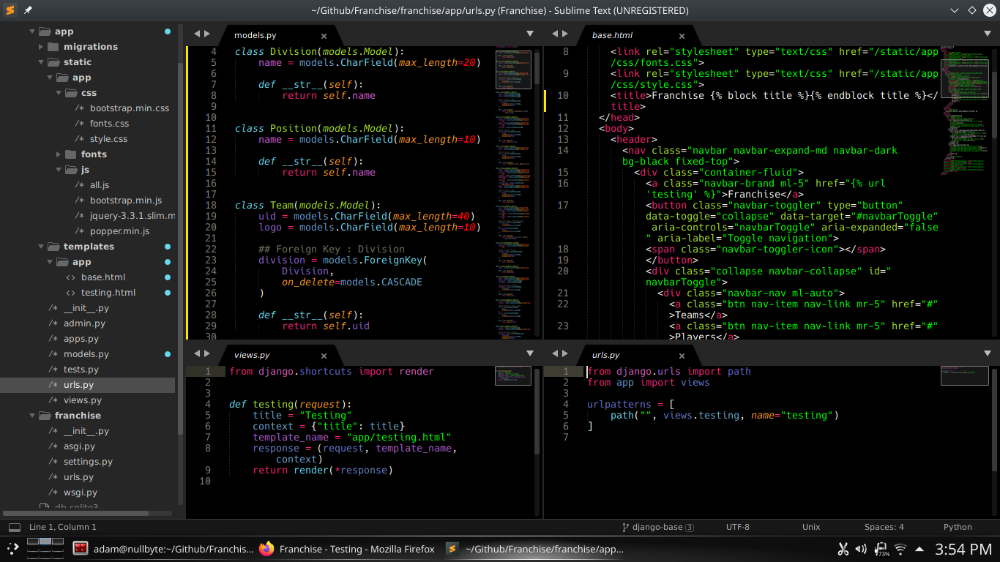
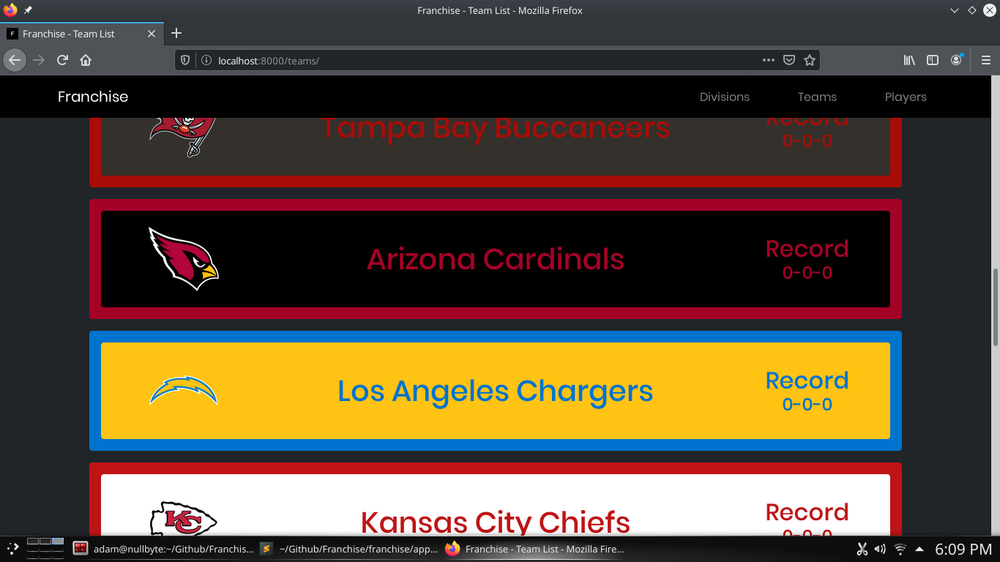

# Franchise
Automatic Fantasy Football Stat Tracking Application

## Setup / Install

```bash
git clone https://github.com/sandmanscanga/Franchise.git
cd Franchise
python3 -m venv venv
source venv/bin/activate
pip install --upgrade pip
pip install -r requirements.txt
cd franchise
cd core
python3 loader.py -b
python3 loader.py -w
python3 loader.py -r
python3 loader.py --get-logos
python3 loader.py --get-headshots
python3 ../manage.py runserver
## Open browser and visit http://localhost:8000
```




